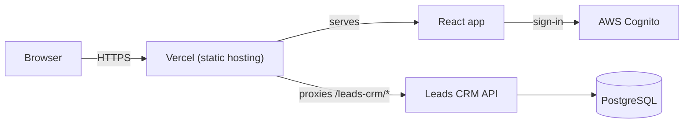

# Leads CRM UI

Frontend for the Leads CRM. React + Vite + TypeScript, built on the same patterns as
`builder-crm-ui`.

## Modules

- Leads, Meetings, Projects
- User Management (Users + a Roles & Permissions matrix editor)
- Channel Partners (built, but hidden from the nav — not needed for this tenant)

## Architecture



## Run it locally

```bash
npm install
cp .env.example .env && npm run dev
```

Fill in the two Cognito values. The dev server proxies `/leads-crm` to `localhost:8090`, so start
the backend too. Without Cognito configured, the app still runs and shows the sign-in screen.

## Deployment

Hosted on **Vercel**. `vercel.json` proxies API calls to the backend and rewrites everything else
to the single-page app.

Set these on the Vercel project:

| Variable | Value |
|---|---|
| `VITE_AWS_COGNITO_USER_POOL_ID` | from the backend's Cognito setup |
| `VITE_AWS_COGNITO_USER_POOL_CLIENT_ID` | from the backend's Cognito setup |
| `VITE_AWS_REGION` | `ap-south-1` |
| `VITE_ENGAGETO_API_KEY` | WhatsApp chat integration key |

Also set `APP_CORS_ORIGINS` on the backend to this app's URL — otherwise every request fails
silently in the browser, while `curl` against the API still looks fine.

## Structure

```
src/
  domains/<module>/   domain, application, infrastructure, presentation
  routes/             TanStack file-based routes
  shared/             UI primitives, data-table, layout
```

## Authorization (RBAC)

Mirrors the backend's two-layer model. `permissions === null` means "unrestricted", not "not
loaded yet" — an explicit loading state avoids a flash of the full UI before real permissions
arrive.

## Production cost

Hosted on **Vercel's free (Hobby) tier — $0/month** at this scale. Upgrade to Vercel Pro
(~$20/month) only if you need a team seat, more bandwidth, or a custom domain.

This app makes no direct LLM calls, so it adds no token cost of its own — AI features (search,
meeting summaries) are billed on the backend through `sales-sdk`.

## Verified

- `npm run build`, `npm run typecheck`, `npm run lint` — all clean.
- Sign-in, RBAC gating, and every module tested against a live backend.

**Known gap:** creating a user, resetting a password, or enabling/disabling one needs backend
Cognito credentials that aren't configured everywhere yet.
